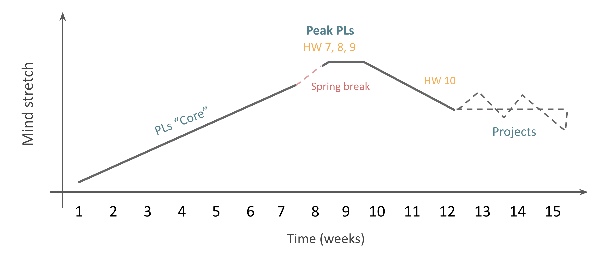

### CS 131: Programming Languages
# Welcome to Programming Languages

**Notes: these notes include information shared during the first day of class, as well as in Module 1.1.**

## Course Information
### Professors
- Lucas Bang, "Prof. Bang" (he/him)
  - Interests: quantitative program analysis, programming, society, and culture, cold brew horchata coffee, singing dogs
- Ben Wiedermann, "Prof. Ben" (he/they)
  - Interests: programming language design + accessibility, programming, society, and culture, platypuses (platypi?)

## Course Mechanics
In this course, we emphasize **Flexibility, Community, and Certainty**. Here's an overview of how the course operates:
- All course materials, including videos, readings, and exercises, are available on Canvas.
- We follow a flipped classroom model where you engage with the course materials before the class session.
- Pair programming is encouraged to foster collaboration and learning from peers.
- We provide office and tutoring hours to address your questions and provide additional support.
- You will have weekly assignments that include completion-based exercises.
- A project and three quizzes will help you apply your knowledge.
- The course follows a highly structured and scaffolded schedule to ensure a smooth learning experience.

## A "Typical Week" in CS 131
To give you an idea of the course flow, here's a breakdown of a typical week in CS 131:
| Sunday                     | Monday                     | Tuesday | Wednesday                   | Thursday | Friday | Saturday |
|----------------------------|----------------------------|---------|-----------------------------|----------|--------|----------|
|                            |                            |         | Modules available Flexible class HW write-up available|          |        |          |
| Sub-module completion due  Previous assignment due| HW fully posted  In-class HW kickoff  Required Class |         | Sub-module completion due  Next Modules posted  Flexible class|          |        |          |
| **Current Assignment due**     |                            |         |                             |          |        |          |

And here are the deadlines and class format for a typical week: 

### Sunday
- Assignment due
- Sub-module completion due

### Monday
- In-class HW kickoff
- Required class

### Wednesday
- Sub-module completion due
- Flexible class

## Detailed Schedule
Throughout the semester, we follow a detailed schedule that outlines the topics, milestones, and assignments. This schedule helps you stay organized and manage your workload effectively. We will explore the schedule in more detail as we progress through the course, but for now, we will look at the schedule at a high-level.

We have structured the curriculum to provide a comprehensive understanding of fundamental programming language concepts while offering  opportunitites for individualized exploration. We refer to the initial phase of the course as "PLs Core." It covers essential topics that would be covered in most programming language classes. Following Spring Break, we reach a phase known as "Peak PLs," where we delve deeper into  concepts that may require a more significant mind stretch. This doesn't necessarily mean there will be more work, but there may be more mental investment needed. 

In designing this course, we've considered the workload you may have in other classes. As some other classes may be ramping up near the end of the semester, we transition to what might feel like a slightly relaxed pace, easing the mental stretch. This allows you to consolidate your knowledge and reflect on the concepts covered throughout the course.

At the culmination of the semester, we engage in final projects. These projects provide an opportunity for you to apply your skills and reinforce your understanding of programming languages. We offer flexibility in project selection, and a few intermediate deadlines will be set to help you stay on track and make steady progress. 

Overall, our aim is to provide a structured yet adaptable learning experience that fosters understanding, growth, and the development of programming language knowledge.

## What is a Programming Language?
In this exercise, take a moment to reflect on the definition of a programming language. Write a definition that you believe would be agreed upon by everyone. Alternatively, write a definition that you personally agree with but others may have differing opinions on. This exercise encourages critical thinking about the nature and purpose of programming languages.

## A Little History and Herstory (Theirstory?)

### The Era of Human Computers
During the 1800s, the concept of a computer differed significantly from today's understanding. The term "computers" referred to individuals employed to perform complex calculations involving logarithms, planetary motions, and trigonometric functions. However, relying on human computation proved to be error-prone and tedious.

### Charles Babbage and the Pursuit of Automation
Recognizing the limitations of human computation, Charles Babbage, often hailed as the "father of the computer," sought ways to automate mathematical calculations. Babbage envisioned mechanical machines that could perform complex computations more accurately and efficiently.

#### The Difference Engine
Babbage's first notable creation was the Difference Engine, a mechanical calculator designed to automate intricate mathematical calculations. Despite multiple design iterations, the project remained incomplete during Babbage's lifetime.

#### The Analytical Engine
Babbage's most ambitious creation was the Analytical Engine, a proposed general-purpose mechanical computer. It surpassed the capabilities of the Difference Engine by incorporating features such as data storage, conditional branching, and loops. The Analytical Engine represented a significant step toward the development of programmable machines.

### Ada Lovelace: The First Computer Programmer
Ada Lovelace, a mathematician, became fascinated with Babbage's machines and their potential. Lovelace attended gatherings where she encountered Babbage's work and began collaborating with him. Her remarkable insights and contributions set her apart.

#### Recognizing the Analytical Engine's Potential
Lovelace recognized that the Analytical Engine had the capacity to transcend basic arithmetic calculations. She envisioned that the machine could manipulate symbols, enabling it to compute more than just numbers. Lovelace's forward-thinking ideas laid the groundwork for the development of programming languages.

#### The First Published Algorithm
Lovelace's extensive set of notes on the Analytical Engine contained what is now acknowledged as the first published algorithm. She described how the machine could be programmed to compute Bernoulli numbers, marking her as the first computer programmer in history.

### Exploring Lovelace and Babbage's Story
For a more immersive experience delving into the captivating narrative of Ada Lovelace and Charles Babbage, Sydney Padua's graphic novel, _The Thrilling Adventures of Lovelace and Babbage_, provides an engaging resource. It offers deeper insights into their groundbreaking contributions and the historical context surrounding the emergence of programming languages.

## Could we compute EVERYTHING?

Philosophers and mathematicians of the past, such as Gottfried Leibniz, George Boole, and John Locke, posed questions about the nature of knowledge, the laws of thought, and what can be known or proven. These inquiries set the stage for advancements in mathematics, logic, and the exploration of computation.

### What Can We Know and Prove?

The questions about knowledge and proof persisted. David Hilbert famously proclaimed, "We must know. We will know." However, Kurt Gödel's incompleteness theorem shattered the dream of a complete and consistent mathematical system. It demonstrated that there are true statements that cannot be proven within a given system.

### What Can We Compute?

Alan Turing and Alonzo Church made groundbreaking contributions to understanding computation. Turing proposed the idea of Turing Machines, simple theoretical devices capable of universal computation. Church developed the Lambda Calculus, a formal system for manipulating symbols that deals with functions. Both Turing Machines and Lambda Calculus contributed to our understanding of computation and the limits of what can be computed.

#### Turing Machines

Alan Turing made a significant contribution to the understanding of computation with his proposal of Turing machines. Turing machines are abstract state machines capable of universal computation. They operate by transitioning between states and manipulating symbols on an infinite tape. Turing machines can perform various computations, but Turing also discovered their limitations. The halting problem demonstrated that there are computations that Turing machines cannot definitively determine, whether a given program will halt or run indefinitely.

#### Lambda Calculus

Alonzo Church developed lambda calculus, a formal system for manipulating symbols, with a particular focus on functions. Lambda calculus deals with the forms and structures of expressions, emphasizing the shape of functions. Church explored the boundaries of what can be computed using lambda calculus and also discovered its limitations. He showed that there are computations that lambda calculus cannot express or compute, leading to the notion of incompleteness in lambda calculus.

#### Equivalence of Turing Machines and Lambda Calculus

Despite their different foundations, Turing machines and lambda calculus were found to be equivalent in terms of computational power. Turing and Church realized that any computation expressible in one system could be simulated in the other. This remarkable insight led to the formulation of the Church-Turing thesis, asserting that any computable problem can be solved by either a Turing machine or lambda calculus.

#### Insight through Equivalence

The discovery of equivalence between seemingly disparate computational systems has been a powerful tool for gaining insight. It allows researchers to delve into the core essence of different systems and uncover hidden connections. Examples of such insights include the relationship between graph theory and linear algebra and the equivalence of logic and type theory.

## Up and Down the Ladder of Abstraction
Programming languages exist on a spectrum of abstraction. At the lowest level, we have Turing Machines, which operate at the bit level and are highly stateful. As we move up the ladder of abstraction, we encounter higher-level languages, such as Assembly Language, imperative languages like C and C++ with manual memory management, higher-level languages like Python with no memory management, and functional languages like Racket, where functions are treated as data. Below we can see more abstract (more math-like!) methods of computing at the top of the table, and more stateful (more engineering-like!) methods at the bottom. 

| Concept/Categorization      | Examples/Notes                                               |
|-------------------------------|-----------------------------------------------------------------------------|
| Lambda Calculus              | Anonymous functions                                                         |
| Pure Functional Languages    | Haskell                                                                     |
| Functional Languages         | Racket                                                                      |
| Higher-level Languages       | Python                                                                      |
| Imperative Languages         | C, C++                                                                      |
| Assembly Language            | HMMM, x86                                                                   |
| von Neumann Architecture      |                                                                             |
| Turing Machine               | Very simple, very low (bit) level, very "stateful"                          |

## Programs = Data!
As we discussed earlier, at the turn of the 20th century, mathematicians sought to automate theorem proving but encountered insurmountable challenges. Gödel, Church, and Turing, prominent figures in this pursuit, shared a common thread of self-referentiality in their approaches. Gödel used logic to reason about theorems, Church explored functions operating on functions, and Turing investigated machines reasoning about machines. These explorations laid the foundation for the realization that there is no intrinsic difference between programs and data.

The profound insight that emerged from these endeavors is the equivalence of programs and data. Although it dashed the dreams of automated theorem proving, it gave birth to computer science as a field. Practical examples demonstrate the interchangeability of programs and data. In app stores, programs are downloaded as files and executed as applications. Interpreters, like Python, take programs as input and execute them, while compilers, such as Clang, transform programs into new programs in different languages. Programs can be represented as strings or tree data structures, depending on the interpreter or compiler being used. Strings represent programs as sequences of characters, while tree structures use nodes to represent values and operations.

## What CS 131 is Not
CS 131 is not a programming languages class that covers one language per week. Such an approach quickly becomes outdated as languages evolve. Instead, this course takes a more fundamental approach, emphasizing key concepts and principles that transcend specific languages.

We recognize that a programming languages class that focuses on individual languages might not be the best approach. Languages change and evolve over time, rendering such an approach easily outdated. For example, a list of popular languages from 30 years ago would differ significantly from what is used in modern development. Functional programming, on the other hand, provides a powerful and enduring paradigm that is rapidly growing in popularity.

## The Power of Functional Programming
Functional programming, our primary focus in this course, offers numerous benefits. By eliminating mutable state and emphasizing function evaluation, functional programming simplifies code, enhances modularity, and encourages a new way of thinking about computation. It complements knowledge of other paradigms and finds applications in critical domains like security and finance.

Functions play a central role in functional programming. They can be treated as data, allowing us to create higher-order functions and compose them to build complex programs. Functional programming languages provide a different perspective on problem-solving, expanding our toolbox of approaches.

Moreover, functional programming concepts are permeating mainstream languages. Modern programming languages, such as C++, Java, and Python, incorporate functional features, making it a valuable skill for programmers.

## Topics Covered in CS 131
Throughout the semester, we will explore a range of topics that reveal the depth and breadth of programming languages. These topics include:

- Pure Functional Languages: Understanding languages like Haskell that eliminate mutable state entirely.
- Functional Programming: Emphasizing functions as data and the evaluation of expressions.
- Pattern Matching: Leveraging the structure of data to simplify programming.
- Representing Data: Exploring data structures from a functional perspective.
- Parsing: Transforming characters into executable programs.
- Interpreters: Understanding the process of turning programs into computation.
- Abstraction: Doing more with less code through abstraction techniques.
- Types: Examining the role of types in computing the right "kind" of information.
- Lambda Calculus: Investigating the fundamental model of computation through lambda calculus.
- Social and Cultural Implications: Considering the impact of programming languages on society and culture.
- Your Ideas: Encouraging your creativity and exploration of programming language concepts.

By covering these topics, we aim to equip you with a solid foundation in programming languages and broaden your perspective on computing. The principles you learn in this course extend beyond individual languages, providing you with a versatile skill set that will endure as programming continues to evolve.

## Programming Languages by People, for People

Programming languages are created by people, for people. They reflect the preferences, biases, strengths, and weaknesses of their creators. People use programming languages to solve different kinds of problems using the best possible tools available.

### Paradigms of Programming Languages

Programming languages embrace different paradigms that reflect distinct ways of thinking about the world and computation.

**Imperative Model:**
- This model centers around data and memory manipulation.
- Examples of imperative languages include C, Java, Python, OCaml, Swift, and JavaScript.

**Functional Model:**
- This model treats computation as the evaluation of expressions.
- Haskell, Racket, and ML are functional languages.
- Functional languages resemble mathematical approaches to problem-solving.

**Declarative Model:**
- Declarative languages allow programmers to describe what they want without focusing on how to achieve it.
- SQL (Structured Query Language) is a popular declarative language used for database operations.
- Declarative languages often target specific domains and problem areas.

### Hybrid and Modern Languages

Modern programming languages often incorporate elements from multiple paradigms. Hybrid languages are designed to allow programming imperatively when it makes sense and functionally when it is appropriate. Examples of hybrid languages include Java, JavaScript, and many others. Purists argue that truly functional languages cannot have imperative features, but for the purposes of this course, the focus is on understanding the design choices and benefits of different paradigms.

### The Impact of Language Design

The design choices made by programming language creators significantly impact the ease or difficulty of programming tasks. By understanding the paradigms and features of different languages, programmers can choose the most suitable tool for a given task. Diversity among language designers prompts reflection on potential influences on language design. Language designers' identities may shape the design of programming languages, and it is worth examining how these choices may affect programming practices and problem-solving approaches.

### The Human Aspect of Programming Languages

Programming languages are not mere sets of syntax rules; they are living technologies created by people. The languages we use influence the way we think, the problems we choose to solve, and the solutions we develop. Considering the impact of programming languages on society, culture, and diversity is essential.

#### Commonly Used Programming Languages

- C (Dennis Ritchie)
- Java (James Gosling)
- Python (Guido van Rossum)
- JavaScript (Brendan Eich)
- Swift (Chris Lattner)
- OCaml (Xavier Leroy, others)
- Scala (Martin Odersky)
- Go (Robert Griesemer, Rob Pike, Ken Thompson)
- Ruby (Yukihiro Matsumoto)
- Rust (Graydon Hoare, others)

It is important to acknowledge that this list predominantly features male language designers, and most are of white ethnicity. While programming languages are not limited to specific genders or ethnicities, the lack of diversity raises questions about the potential impact on language design and biases in the industry.

