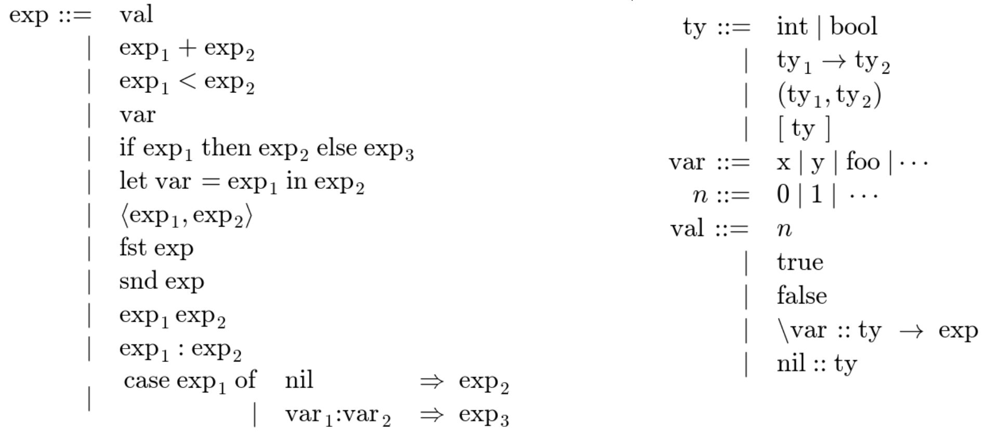

### CS 131: Programming Languages

# Types

In this lecture, we will explore the concept of types and their role in programming languages. Types provide a way to define and interpret data, enforce restrictions, catch errors, and enable efficient code generation. Let's dive into the details.

## Understanding Types
To warm up, let's consider the following question: What is the same and what is different about this data? 

| Value | Description |
|-------|-------------|
| 1617972849 | Big-Endian Integer |
| 1900965984 | Little-Endian Integer |
| 1.02223624099482e+30 | IEEE 32-bit Floating Point |
| `pNq | ASCII/UTF-8 |
| 恰乱 | UTF-16 |
| ld h,b; ld (hl),b; ld c,(hl); ld (hl),c | Z80 Assembly (8-bit instructions) |
| bra pc+0x70; nop | m68k Assembly (16-bit instructions) |
| call pc+0x81c139c4 | x86 (variable-length instructions) |
| 0x 60 70 4E 71 | Hexadecimal notation |
| 01100000011100000100111001110001 | Raw bits (binary) |

Looking at the provided example, we can observe that the 32 bits at the bottom can be interpreted in various ways. Depending on how we consider these bits, we can translate them into integers, ASCII characters, Unicode characters, assembly language instructions, or even decimal numbers. The key point here is that without knowing how to interpret the bits, we cannot fully understand their meaning. This is where types come into play. Type information tells us how to interpret and understand data stored in computer memory.

## What is a Type?
A type can be viewed from different perspectives:

1. **Abstraction**: Types allow us to abstract a collection of individual data pieces. For example, we can abstract the values 7, 5, and -53 into the concept of integers. This abstraction enables us to discuss the properties and operations associated with integers as a whole.

2. **Definition and Constraints**: Types define what data is and what can be done with it. They establish a set of allowed values and provide a set of fundamental operations for manipulating those values. For instance, the `num` type class in Haskell requires support for operations such as addition, multiplication, absolute value, sign retrieval, integer conversion, and negation. By adhering to these constraints, we gain insight into the capabilities and limitations of a particular type.

3. **Label and Context**: Types act as labels for humans and provide context for data. When we identify something as a "tree of strings," we instantly understand the kind of operations and interactions we can expect with that data type. Types help us understand the utility and intended use of specific data.

4. **Composition**: Types can be combined to create more complex types. We can build composite types by combining base types. For example, a tuple type, such as `(Bool, Char)`, combines the base types `Bool` and `Char` into a single composite type.

## The Role of Types
Types serve multiple purposes and offer several benefits in programming languages:

1. **Error Detection**: Types help catch programming errors by identifying mismatches between expected and actual data types. For example, if we try to add an integer to a string, the type system will raise an error, preventing a potential logic error.

2. **Efficiency Optimization**: Types assist compilers in generating more efficient code. By knowing the types of data, compilers can leverage specific properties and optimize code execution. For instance, the commutative nature of addition allows a compiler to reorder integer additions for better performance.

3. **Information Interpretation**: Types provide an interpretation for data, allowing us to understand the meaning and representation of bits stored in memory. Types guide us in interpreting data correctly.

4. **Behavior Restrictions**: Types impose restrictions on what operations can be performed on specific data. They prevent invalid operations and ensure that operations adhere to the rules defined for each type. For example, performing uppercase operations on integers is not valid.

In summary, types are invaluable tools in programming languages. They guide us in writing correct code, optimize program execution, provide interpretations for data, and enforce behavior restrictions. Understanding types is crucial for developing robust and efficient software.


## Type Systems

A type system is a system of rules that governs the use of types in a programming language. It defines how types are assigned to expressions, how they interact with each other, and what operations are allowed on them.

Type systems provide a formalized way to reason about the correctness and behavior of programs. They ensure that programs adhere to the specified type rules and prevent type conflicts that could lead to errors.

### Type Conflicts
Type conflicts, also known as type errors, occur when incompatible types are used in a program. For instance, in Java, assigning an integer value to a string variable would result in a type error. Similarly, attempting to apply a function to the wrong type of value, such as calling the `upper` function on a boolean value in Python, would also generate a type error.

### Well-Typed Programs
A well-typed program is a program that adheres to the rules and constraints defined by the type system. It means that the program has no detected type conflicts, and all the operations are performed with compatible types.

For example, assigning an integer value to an integer variable, performing arithmetic operations on compatible numeric types, or applying a function to arguments of the correct types are examples of well-typed operations.

In statically typed languages like Haskell or C++, the type checking is performed at compile-time, ensuring that the program is well-typed before execution. In dynamically typed languages like Python or Racket, type errors may be discovered during runtime.

#### Example: Is This Expression Well-Typed?
Consider the following expression:

```haskell
let x = 1 in x + 1
```

The expression assigns the value 1 to the variable `x`, which is of type integer. It performs an addition operation between `x` and 1 using the `+` operator, which is defined for integers. Therefore, the expression is well-typed.

It is worth noting that Haskell, unlike some other languages, enforces type checking before running a program. This means that a program will not be executed unless it is well typed.

### Variety of Type Systems
There is no one-size-fits-all type system, and different languages may adopt different approaches based on design choices and language requirements. Therefore, it is essential to consider the specific needs and goals when designing a type system.

### Handling Type Errors
Different languages handle type errors in distinct ways. For instance, let's consider the following program:

```
“one” + 2
```

1. JavaScript: When adding a value to a string, JavaScript attempts to convert the value into a string and performs string concatenation. `"one" + 2` would result in the string "one2".

2. Perl: In Perl, adding a string to a numeric value yields different results. If the string contains a numeric character, it converts the string into an integer and performs addition accordingly. Otherwise, it treats the string as zero. Adding the string "one" to the number 2 results in the value 3.

3. Haskell: Haskell, being statically typed, would consider the expression `"one" + 2` as a type error. It recognizes that adding a string to a number is invalid, as the types are incompatible.

It is essential to remember that the treatment of type errors depends on the language's design and philosophy.

### Static Typing vs. Dynamic Typing
Type systems can be categorized into two main types: static typing and dynamic typing.

1. Static Typing: Languages like Haskell and C++ employ static typing, where type errors are detected during the compilation phase. The compiler examines the code for potential type errors before executing it. If type errors are found, the programmer must rectify them before the code can run.

2. Dynamic Typing: Languages like Python and Racket utilize dynamic typing, where type errors are identified during runtime. The code is executed sequentially, and if a type error occurs, an error is raised, halting the program's execution.

## Formalizing Type Checking: Grammars

To represent possible types and their relationships, we can use grammars. Grammars provide a way to specify the syntax and structure of types in a concise and formal manner. The syntax below is similar to Haskell but much more simplified. If there are things that look Haskell-y, then they probably behave in the same way.




Recognizing a grammar as a specification is an essential skill in CS131. It allows us to understand what the grammar is trying to tell us.

## Typing Rules

Typing rules define the rules and constraints for assigning types to expressions and statements in a programming language. They specify how the types of subexpressions and variables influence the type of the overall expression or statement.

Typing rules include rules for basic types, operators, variables, functions, control flow structures, and more. They define the conditions under which a program is considered well-typed.

To establish the well-typedness of a program, we can show that the typing rules are satisfied, similar to writing a proof. This connection between types and proofs is known as the Curry-Howard Correspondence.

## Curry-Howard Correspondence

The Curry-Howard Correspondence is a fundamental concept that establishes a connection between types and proofs. It states that a proof is a program, and the formula it proves corresponds to the type for the program.

In other words, showing that a program is well-typed is equivalent to writing a proof. Just as a proof provides evidence for the truth of a mathematical statement, a well-typed program provides evidence for the correctness of its computations.

The Curry-Howard Correspondence is named after mathematicians Haskell Curry and William Howard, who independently discovered the connection between types and proofs. It highlights the deep relationship between logic, programming languages, and type systems.

## Types and Proofs

In CS81, you learned about Natural Deduction, which follows the structure:

```
premise1    premise2  …    premiseN
----------------------------------
        conclusion
```

When it comes to type systems, we can view typing rules as analogous to the premises and conclusions in natural deduction. By applying the typing rules, we can infer the type of an expression or program, just as we can derive conclusions based on premises in a proof.

## Type Environments

Type environments play a crucial role in type checking. They store information about the types of variables in a program and provide a context for type inference and checking.

A type environment is a mapping that associates variables with their corresponding types. It keeps track of the types of variables encountered during the program's execution and ensures that expressions and statements use variables of the correct types.

Type environments are especially important when dealing with variables, as the types of variables can influence the overall types of expressions and statements. By maintaining a type environment, we can accurately determine the types of complex expressions involving variables.

